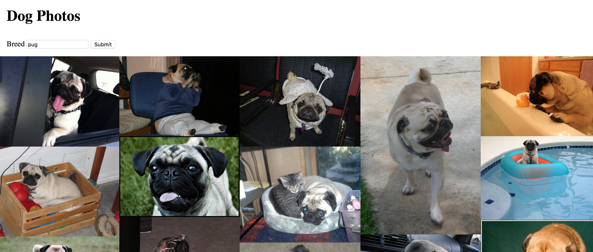

# Lab: Requests Dogs API

### Learning Objectives

- Be able to make a request using fetch
- Be able to display response data in an application

## Brief

Your task is to create an application that makes a request to the [Dog's CEO API](https://dog.ceo/dog-api/), to get a collection of dogs photos, and display them to the page. Use the the endpoint`https://dog.ceo/api/breed/pug/images` to get back a collection of pugs.



*Screenshot of Example Result*

Use the start code provided. To run the start code you will need to:

```bash
// install dependencies
npm install

// run webpack
npm run build

// run the app
open public/index.html
```

### MVP

When the page loads, make the request to the Dogs.ceo API for a collection of images of pugs, and display them on the page.

Start by requesting the data and logging it to the console. At this point you know you have successfully loaded the data into your application. Once you have done this you can work on displaying it in a view.

### Extensions

Create a form that allows for a user to enter a breed. When the form is submitted a new request should be made with their chosen breed, and the photos should be displayed on the page.
