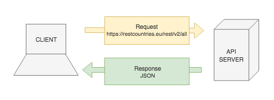

# Requests with Fetch

**Lesson Duration**: 90 minutes

### Learning Objectives

- Understand what a JSON API is and why we use them
- Be able to make a get request using `fetch`
- Be able to traverse a JSON object

## Intro

In this lesson we are going to learn how to request data from an API, so that we can use it in our applications. This can save us a great deal of time, preventing us from having to create the data ourselves.

### What is an API

An API, or application programming interface, is a tool that allows one piece of software to interact with another. A lot of software provides an API, allowing developers to write software that interacts with it. The DOM, for example, is an API. The DOM allows us to write software that interacts with the web browser.

As well as providing us with functionality, some APIs simply provide us with data. We can use this data to enhance the functionality of our applications. Modern APIs tend to provide us with data in JSON format. Some older APIs may still use XML, but that's becoming less popular as JSON continues to gain traction. We'll come back to JSON shortly.

### Why Would We Use an API?

APIs often provide us with functionality or data that would be incredibly difficult and time consuming to create on our own.

Let's imagine that you were building a travel app and needed data about all of the countries in the world. You *could* spend time collecting and organising the data yourself, but it would be very time consuming. It would be much more convenient to use an API like [RESTCountries](http://restcountries.eu/) that can provide us with data that someone else has already prepared.

RESTCountries provides us with data about all of the countries in the world in JSON format.

We can see a list of endpoints on their website. An endpoint is essentially a URL that we can make a request to, allowing us to access the API. Let's take a look at the [all](https://restcountries.eu/rest/v2/all) endpoint. You might install the [JSON Formatter](https://chrome.google.com/webstore/detail/json-formatter/bcjindcccaagfpapjjmafapmmgkkhgoa) Chrome extension to allow the browser to format the data in a more human readable way.

### What is JSON?

JSON, JavaScript object notation, is a language agnostic data interchange format derived from JavaScript. It allows us to store data in a human readable format that appears familiar to programmers of C family languages.

When we say that JSON is language agnostic, we mean that it doesn't know anything about any other programming languages. We will be converting JSON to JavaScript today, but we could just as easily make a request from a .NET application, written in C#, and convert the resulting JSON data to C#. This means that we can use JSON as a common language allowing software that was written in different languages to speak to each other.

While JSON may look very familiar, there are a couple of key differences that we must bear in mind. All JSON is valid JavaScript, but not all JavaScript is valid JSON.

1. The keys in a JSON object must be quoted
2. Strings must be declared with double quotes `""`
3. A JSON object cannot contain functions

## Before We Get Started

We're going to write an app that makes a request to an API which provides us with a random joke, which we will then display in the browser.

> Instructor Note: Hand out the start point along with the following task

### Task: (5 minutes)

Read over the start code and answer the following questions.

Where should we make the request?

<details>
<summary>Answer</summary>

`Countries.getData()`
</details>

<br>

Which channel should we publish an event on once we have the data?

<details>
<summary>Answer</summary>

`'Countries:data-loaded'`
</details>

<br>

Before we write any code let's think about what we're about to do.

1. Make a request to the restcountries API
2. restcountries will respond to our request with JSON
3. Use the data in our application



*API Request and Response Diagram*

## Making a Request

Our `Countries` model already has a `getData` method, which we will use to make a request to `'https://restcountries.eu/rest/v2/all'`.

Network requests are asynchronous. This has two major implications.

1. They take an unspecified amount of time to complete
2. Execution of the rest of our code is not paused in the mean time

JavaScript has a feature called a promise which helps us handle asynchronous code.

### What is a `Promise`?

We typically create a `Promise` when we want to retrieve data via some asynchronous operation. This could be requesting data from an API or a database, for example.

Just like a real life promise that represents something that will happen in the future, a JavaScript `Promise` object represents the result of an asynchronous operation. In our case the `Promise` object will represent the data that we hope to get back from the RestCountries API. With regards to asynchronous JavaScript, this allows us to use the `return` keyword inside of functions without worrying that the data might not have been received yet.

We can `return` a `Promise` and then decide what to do once the asynchronous operation has completed. This allows us to pass fewer callbacks around, meaning that our code reads a bit more as if it were synchronous, which can be easier to follow.

### How Does a `Promise` Work?

When we create a `Promise` object it will be pending until the asynchronous operation that we are wrapping has completed. Then, just like a real life promise that can be kept or broken, the `Promise` object will either `resolve`, if successful, or `reject` if something goes wrong, allowing us to decide what to do next. We may want to render the data that was received, or perform some kind of error handling if the `Promise` rejected.

We can also chain multiple asynchronous operations by chaining functions which return a `Promise`.


_A Promise Chain_

## `fetch`

`fetch` is a web API which we can use to make HTTP requests and it returns a promise, that, once resolved, will give us the response data from the network request. `fetch` offers very concise syntax to make our request and handle the response data.

We'll invoke `fetch`, passing our URL of the API to it.

```js
// countries.js

Countries.getData () {
  const url = 'https://restcountries.eu/rest/v2/all'; // NEW

  fetch(url) // NEW
}
```

If we open up the network tab and refresh the page in the browser, we can see that our request to restcountries is responding with a status code of 200. This means that it's completing successfully. If we click on the response we can see the data is being sent in the response body.

As we discussed, `fetch` returns a `Promise` object. This object represents the `Response` that we will get back from the server that we're making our request to.

We can use `then`, to decide what to do next. `fetch` will pass the `Response` (`res`) object to our `then` callback, which we will parse into JSON using the `json` method.

```js
getData() {
  const url = 'https://restcountries.eu/rest/v2/all';

  fetch(url)
    .then(res => res.json()) // UPDATED
}
```

We are returning the json data, which we can handle in another then. Let's log our data in the next `then`.

```js
getData() {
  const url = 'https://restcountries.eu/rest/v2/all';

  fetch(url)
    .then(res => res.json())
    .then(countriesData => console.log(countriesData)) // NEW
}
```

Great, we can now see we have loaded the JSON into our application and logging it to the console. Let's now replace the log by storing the data on the model

```js
getData() {
  const url = 'https://restcountries.eu/rest/v2/all';

  fetch(url)
    .then(res => res.json())
    .then(countriesData => {
      this.data = data; // UPDATED
      PubSub.publish('Countries:data-loaded', this.data); // NEW
    })
}
```

We should now see a list of the country names being displayed in the browser.

Lastly we can add a `catch`, which will catch any errors.

```js
getData() {
  const url = 'https://restcountries.eu/rest/v2/all';

  fetch(url)
    .then(res => res.json())
    .then(countriesData => {
      this.data = data;
      PubSub.publish('Countries:data-loaded', this.data);
    })
    .catch((message) => { // NEW
      console.error(message);
    });
}
```

That's it, we have now made a request within the model, and once it has been received, we have published it out to the rest of our application.

## Refactoring - Request Helper

We're getting data from an API and displaying it in our app. This is great, but our code could be cleaned up a little. What if we wanted to make a separate request to another API in a different model? We would have to repeat everything that we have just written in that model too. It may be better if we extracted the network request code into a helper model.

We'll create a `RequestHelper` in our helpers directory.

```sh
touch src/helpers/request_helper.js
```

Let's create the `RequestHelper` class. It is going to have a constructor that stores the API's URL as a property. It will also have a `get` method that will be responsible for making the request.

```js
// RequestHelper.js

class RequestHelper {

  constructor(url) {
    this.url = url;
  }

  get() {

  }

}

module.exports = RequestHelper;
```

So we are going to do the same we did in our Countries model: we are going to called `fetch`, passing it the API's URL that we want to make a request to. We are then going to parse the response text into JSON in a `then`.

```js
get() {
  return fetch(this.url)
    .then((res) => res.json());
}
```

This whole express will return a promise, so because we are returning it from this `get` function, we can decide what we actually want to do with the data back in out model.

To use the request helper in the model we need to require it in, and instantiate it, passing it the RestCountries URL.

```js
// countries.js

const RequestHelper = require('../helpers/request_helper.js'); // NEW

getData() {
  const url = 'https://restcountries.eu/rest/v2/all';
  const request = new RequestHelper(url); // NEW

  fetch(url)
    .then(res => res.json())
    .then((data) => {
      this.data = data;
      PubSub.publish('Countries:data-loaded', this.data);
    })
    .catch((message) => {
      console.error(message);
    });
}
```

Next we want to refactor the function, so that it delegates the `fetch`ing to the `RequestHelper`. We call `request.get()`, which once resolves gives us the parsed JSON countries data. We handle this using a `then`, which publishes the data out to the application.

```js
getData() {
  const url = 'https://restcountries.eu/rest/v2/all';
  const request = new RequestHelper(url);

  request.get() // UPDATED
    .then((data) => {
      this.data = data;
      PubSub.publish('Countries:data-loaded', this.data);
    })
    .catch((message) => {
      console.error(message);
    });
}
```

Now our application works as before, but now we have a request helper, so if we need to make other requests in the application, we can use it to keep our code DRY.


### What is a `Promise`?

We typically create a `Promise` when we want to retrieve data via some asynchronous operation. This could be requesting data from an API or a database, for example.

Just like a real life promise that represents something that will happen in the future, a JavaScript `Promise` object represents the result of an asynchronous operation. In our case the `Promise` object will represent the data that we hope to get back from the RestCountries API. With regards to asynchronous JavaScript, this allows us to use the `return` keyword inside of functions without worrying that the data might not have been received yet.

We can `return` a `Promise` and then decide what to do once the asynchronous operation has completed. This allows us to pass fewer callbacks around, meaning that our code reads a bit more as if it were synchronous, which can be easier to follow.

### How Does a `Promise` Work?

When we create a `Promise` object it will be pending until the asynchronous operation that we are wrapping has completed. Then, just like a real life promise that can be kept or broken, the `Promise` object will either `resolve`, if successful, or `reject` if something goes wrong, allowing us to decide what to do next. We may want to render the data that was received, or perform some kind of error handling if the `Promise` rejected.

We can also chain multiple asynchronous operations by chaining functions which return a `Promise`.


_A Promise Chain_
