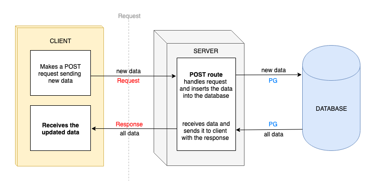

# Express API Quiz

1. When using Express Generator to create the boilerplate code, why do we include the `--no-views` flag? (1)

  Because we don't want to generate any views as we are making a back-end API that serves up JSON. Our front-end client (with it's views) are created in a separate application.

2. What does HTTP stand for? (1)

  HyperText Transfer Protocol

3. What does URL stand for? (1)

  Uniform Resource Locator

4. Which HTTP verb is used for retrieving data? (1)

  GET

5. Which HTTP verb is used for updating data? (1)

  PUT

6. True or False - HTTP is stateless? (1)

  True

7. Which status code might you get if there is a server error? (1)

  500

8. What would we not have access to if we didn't install and configure body-parser in our server? (1)

  The request's body. For example, the data being sent by the client to be added to the database on a post route.

9. Name two responsibilities of the server? (2)

  - Define a set of routes
  - Listen for requests being made on a specific port number

10. Name two responsibilities of a route? (2)

  - Access any data from the incoming request (e.g. params or body)
  - To access the database, inserting data into it or retrieving data from it where appropriate.
  - Send a response back

11. Name three things to we need to define when creating a new route in our server? (3)

  - method (e.g. GET)
  - route (e.g. '/')
  - behaviour (e.g. callback to be run when request is made)

12. What do we use the package nodemon for? (1)

  To listen to changes we make to the server while developing, so we don't have to restart it every time we make a change.

13. What do we use the package pg for? (1)

  To connect and interact with a database from our JavaScript server

14. Draw a diagram to represent the request-response cycle in a POST request, including the database, server and client (3)

