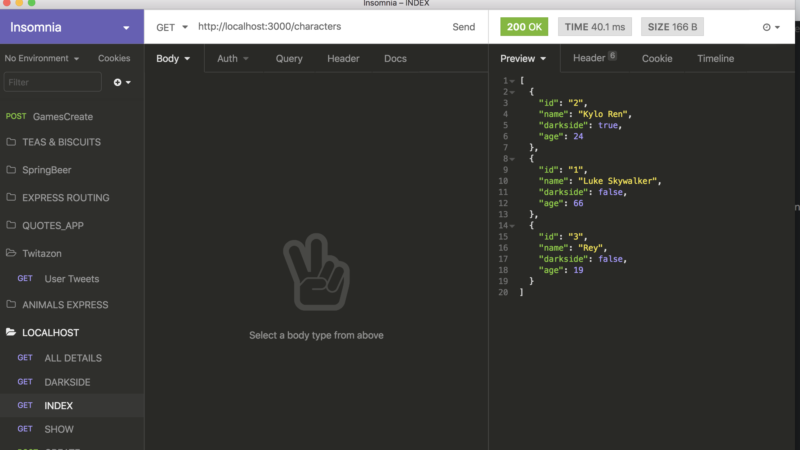

# Star Wars Front-end

**Lesson Duration: 75 minutes**

### Learning Objectives
- Know how to create a JS front end to get and display a list of resources

## Intro

We'e going to add a front end to our Star Wars API. The goal is to get a list of characters and display them on a web page.

## Recap

We have an API that will respond with a JSON representation of all the characters. We can use Insomnia to make the request.



We're going to replace Insomnia with a JavaScript client, also known as our front end.

Let's go through an exercise.


## TASK

Use the start_point provided or start up your Star Wars API.

> star_wars_start_point

We're going to run our server and make requests from our client.

```sh
// ./server

npm run server:dev
```

Ok, now we need to start out client server.

```sh
cd client
npm start

# New tab
npm run build
```

### Semantic UI CSS

In our start point we've included a link to a stylesheet. Semantic UI is a collection of CSS classes that we can use in our app. It makes it fast and easy to create a User Interface.

There are many other CSS libraries and frameworks available. Often, they'll include JavaScript functionality as well as CSS. Here, we're just using the CSS part of Semantic UI.

For example we can style **cards** quite easily by using the CSS classes available in Semantic UI.

> https://semantic-ui.com/views/card.html

```html
  <link rel="stylesheet" href="https://cdn.jsdelivr.net/npm/semantic-ui@2.4.2/dist/semantic.min.css">
```

### CDN

Notice the link to the Semantic UI css stylesheet **cdn.jsdelivr.net**. The CDN part stands for Content Delivery Network. It's a place where the CSS is stored and we can (relatively) safely be sure that the CDN will make it available to us.


> Question: What port is the client running on? 3001. A different port from the server. Our client and our API are decoupled.

If we browse to our client at localhost:3001 let's have a look at the error message in the dev console.

### CORS

We have a CORS error. Cross Origin Resource Sharing. This is a browser security that doesn't allow JavaScript to get data from a server that hasn't said it's ok. So we need to add a package to our server that will let JavaScript talk to the server.

```sh
npm install cors
```

```js
// server/app.js

var cors = require('cors');

app.use(cors());
```

If you refresh your browser now you should see a list of the characters from our database!

## Adding a FORM

```html
<!-- index.html -->

<form id="character-form" class="ui form">
  <div class="three fields">

    <div class="field">
      <label for="name">Name:</label>
      <input type="text" id="name"/>
    </div>

    <div class="field">
      <label for="darkside">Darkside:</label>
      <select class="ui dropdown" name="darkside">
        <option value="true">True</option>
        <option value="false">False</option>
      </select>
    </div>

    <div class="field">
      <label for="age">Age:</label>
      <input type="number" id="age" step="1"/>
    </div>

  </div>

  <input type="submit" class="positive ui button" id="save" value="Add Character">

</form>

```

We need a JavaScript class to go with our form

```sh
touch src/views/character_form_view.js
```

```js

// src/views/character_form_view.js

const Characters = require('../models/characters');

class CharacterFormView{

  constructor (element) {
    this.element = element;
  }

  bindEvents() {
    this.element.addEventListener('submit', (evt) => {
      evt.preventDefault();
      const newCharacter = {};
      newCharacter.name = evt.target['name'].value;
      newCharacter.darkside = evt.target['darkside'].value;
      newCharacter.age = evt.target['age'].value;

      const characters = new Characters();
      characters.postCharacter(newCharacter);

      this.element.reset();
    });
  }
}

module.exports = CharacterFormView;

```

Let's create a new instance of CharacterFormView in app.js

```js
// app.js
const CharacterFormView = require('./views/character_form_view.js');

const characterForm = document.querySelector('#character-form');
const characterformView = new CharacterFormView(characterForm);
characterformView.bindEvents();
```

Finally we want to add a nested query in our backend server to return all the characters once a new one is added.

```js
// server/app.js

/* CREATE a new character. */
router.post('/', function(req, res) {
  SqlRunner.run("INSERT INTO characters (name, darkside, age) VALUES ($1, $2, $3)", [req.body.name, req.body.darkside, req.body.age])
  .then(() => {
    SqlRunner.run("SELECT * FROM characters ORDER BY name ASC")
    .then((result) => {
      res.status(201).json(result.rows);
    });
  });
});

```
