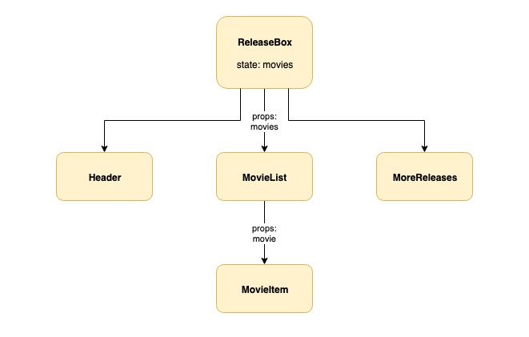

# Homework: React Film Releases Solution

## Part 1
A diagram that details:
  - the component hierarchy (which component renders which)
  - any props that are passed from parent to child components
  - any state inside any of the components

## Part 2

1. Where do we directly access an element from the DOM in our React application?

In index.js to access the DOM "root" element that we render the top-level component to. This is the only place in the application where we access the DOM directly.

2. From looking at the code, what do you think might be the difference between the components in the `containers` and `components` directories?

Components in the `containers` directly contain logic and application state, whereas components in the `components` directory are purely presentational. This a convention used to help us organise our components.

3. What is the responsibility of the `ReleasesBox` component?

`ReleasesBox` stores the application data, and renders the rest of the components.

3. What is the responsibility of the `MovieList` component?

`MovieList` is passed the array of movies by `ReleasesBox` on props. It iterates over the collection, rendering a `MovieItem` for each movie object.

4. What is the responsibility of the `MovieItem` component?

`MovieItem` is pass the data for an individual movie and renders it.
