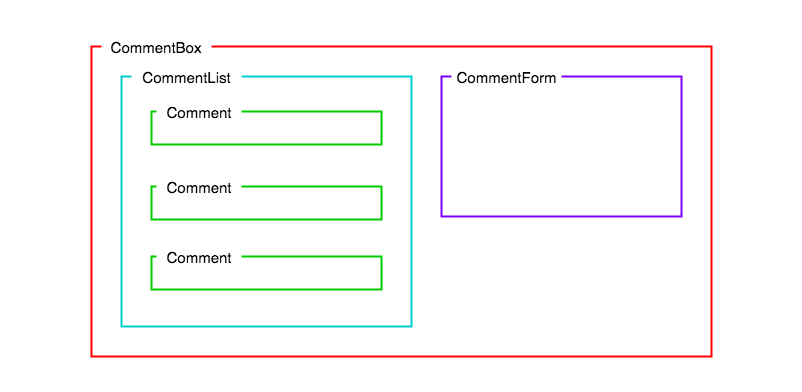

# Lab: Multiple Components Application Comments

### Learning Objectives

- Be able to use separate components to render different parts of the UI
- Be able to dynamically render a collection of components
- Be able to use the container/component directory structure to organise components

## Brief

Your task is to create an application that displays a list of comments. Later we will be adding a form that enables a user to add their own comments, but for now you need to take the collection of data provided and render each comment to the screen in a static list.

### MVP

A user should be able to see a list of comments displayed on the page.

Here is a diagram of how the UI should be broken up into components.

And here is a diagram of the component hierarchy your app should follow.

NOTE: You are not being asked for create the form component.

### Extensions

Validate your props using the `prop-types` package.
