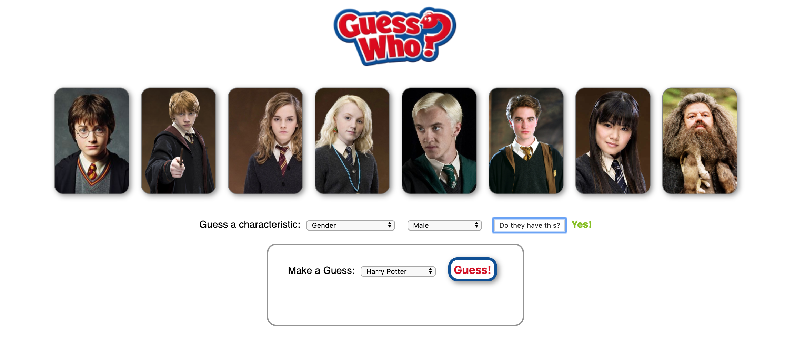

# Lab: React Game Guess Who - Harry Potter

### Learning Objectives

- Be able to update state via a callback
- Be able to update the screen on user input
- Be able to integrate game logic into a React app

## Brief

Your task is to build a single player game of Guess Who. The computer will choose a random character, and the user has to ask questions to guess which is the winning character.

There is a character data set and character images provided.

### MVP

- The computer should select a secret character.
- The player should be able to ask questions about the secret character and recieve a yes/no answer.

### Extensions

- A player should be able to make a guess as to which is the secret character, and see it their guess was correct.

### Planning

Draw a component diagram that details and state and props before you begin.