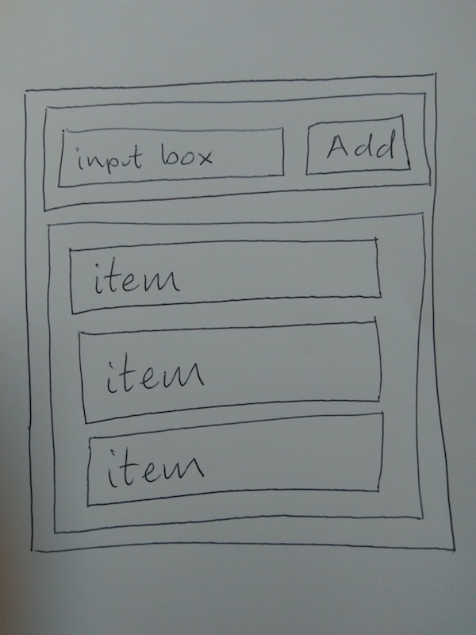

# React Recap

We're going to consolidate our learning and build a little restaurant list app.


- RestaurantListContainer: The top-level component
  - InputArea: A wrapper around the input + button input
    - An HTML5 input
    - An HTML5 button

* RestaurantList: The list of items (its root will be a `<ul>`)
  - Each row is an `<li>`

```bash
create-react-app restaurant_list
```

So we know we need 3 components.

```bash
touch src/RestaurantListContainer.js src/RestaurantList.js src/InputArea.js
```

Let's replace the App with our RestaurantListContainer.

```js
// index.js

import RestaurantListContainer from "./RestaurantListContainer";

ReactDOM.render(<RestaurantListContainer />, document.getElementById("root"));
```

## The Bottom Up Mock Data Approach

This is a way of approaching a React app and consists of:

1. Starting with the simplest, innermost component. In this case, we'll start with the RestaurantList
2. Use 'hard coded' mock data for any props values

Ok now let's create our components.

```js
import React, { Component } from "react";
import PropTypes from "prop-types";

class RestaurantList extends Component {
  render() {
    return (
      <ul>
        <li>Restaurant 1</li>
        <li>Restaurant 2</li>
        <li>Restaurant 3</li>
      </ul>
    );
  }
}

RestaurantList.defaultProps = {
  items: []
};

export default RestaurantList;
```

```js
//InputArea.js

import React, { Component } from "react";

class InputArea extends Component {
  constructor(props) {
    super(props);
    this.state = {
      text: ""
    };
    this.setText = this.setText.bind(this);
    this.handleClick = this.handleClick.bind(this);
  }

  setText(event) {
    this.setState({ text: event.target.value });
  }

  handleClick() {
    console.log("handling click");
    // Let's leave this commented out until we can pass down a function
    // this.props.onSubmit(this.state.text);
  }

  render() {
    return (
      <div>
        <input value={this.state.text} onChange={this.setText} />
        <button onClick={this.handleClick}>Add</button>
      </div>
    );
  }
}

export default InputArea;
```

```js
// RestaurantListContainer

import React, { Component } from "react";
import InputArea from "./InputArea";
import RestaurantList from "./RestaurantList";

class RestaurantListContainer extends Component {
  constructor(props) {
    super(props);
    this.state = {
      restaurants: []
    };
    this.addItem = this.addItem.bind(this);
  }

  addItem(name) {
    this.setState({
      restaurants: [].concat(this.state.restaurants).concat([name])
    });
  }

  render() {
    return (
      <div>
        <InputArea onSubmit={this.addItem} />
        <RestaurantList items={this.state.restaurants} />
      </div>
    );
  }
}

export default RestaurantListContainer;
```

Let's start out app and then go back and replace the 'hard coded' parts with real values.

```bash
npm start
```

```js
//InputArea

handleClick() {
  this.props.onSubmit(this.state.text);
}

```

```js
//RestaurantList

class RestaurantList extends Component {
  render() {
    return (
      <ul>
        {this.props.items.map((item, index) => (
          <li key={index}>{item}</li>
        ))}
      </ul>
    );
  }
}
```

## Testing

```
mkdir src/__tests__
```

We can call our test files InputArea.test.js or put them in a **tests** library. Jest will recognise either.

```
touch src/__tests__/InputArea.test.js
touch src/__tests__/RestaurantList.test.js
```
