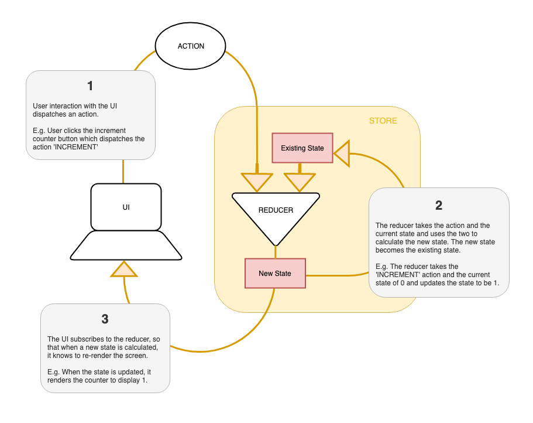

# State Management: Introduction to Redux

### Learning Objectives
- Understand the benefits of using a state management library
- Know the event and data flow through Redux in an application
- Be able to use Redux to manage state

## Introduction

As our front-end applications grow, the application state has the potential to become more complex. When building component-based UI's, keeping state in the components can lead to lots of passing down of state and callbacks, sometimes through many components layers, to give the child components access to the state they need.

State management systems allow us to separate the application state from our component based UI's, so the state can be accessed from whenever needed. This reduces the amount of passing around of data and callbacks by creating a single source of truth, making the application easier to reason about and maintain.

### Redux

[Redux](https://redux.js.org) is a state management library. It is small collection of methods that allow us to create `store` objects that keep track of our application state and give us a collection of methods that allows us to read and update the state.

The Redux library is based on the following concepts:

- Store - keeps track of the application state
- Reducer - is responsible for deciding how the state should be updated
- Action - when dispatched, triggers the reducer to calculate the new state

The event and data flow through redux looks like the following:

- The initial state of the application is defined.
- Every time we want to update the application state (for example, a user clicks a button or an API request completes) we dispatch an action.
- Each dispatched action is received by the reducer. The reducer is responsible for defining how that specific action should alter the state. It uses the existing state and the action to calculate the new application state.
- We can then subscribe to the store, to listen for changes to the state, and use updates to trigger a re-rendering of the UI.



*Event and data flow of Redux*

## Using Redux: Coffee Counter Application

We can use Redux in conjunction with front-end frameworks, but for this lesson we are going to use redux in a vanilla JavaScript app, and even write some of Redux's methods ourselves, to get a better understanding of what is going on under the hood.

The benefit of using redux allows us to centrally manage complex application state, but when learning how to use it, it is easiest to start with very simple application state. With this in mind, we are going to build a coffee counter app, that allows a user to keep track of how many coffees that have drank. It will start by displaying zero, and allows a user to increment the number by one each time they click a button.

> Note: Open start code

We have some boilerplate start code with the html structure defined, an app.js and webpack configured.

Install the start code's dependencies, and run webpack to generate the bundle.js

```bash
npm install
npm run build
```

Open the index.html in the browser and check the JavaScript is loading by looking for the output message in the console.

### Redux

Redux is an npm package, so let's start by installing it.

```bash
npm install redux
```

To use Redux we need to require it into app.js. Let's also log the whole library to the console, so we have have a look at it.

```js
// app.js

const Redux = require('redux'); // NEW

document.addEventListener('DOMContentLoaded', () => {
  console.log(Redux); // UPDATED
});
```

We can see that Redux is an object containing 5 functions: `applyMiddleware`, `bindActionCreators`, `combineReducers`, `compose` and `createStore`. In this lesson, we are only going to be using `createStore`. `createStore` returns a `store` object, with 3 more useful functions on it:

1. `getState()` - gets the current state of the store.
2. `dispatch()` - takes an action and dispatches it.
3. `subscribe()` - listens for when the store's state changes.

### Redux in the Counter Application

So, thinking about the event and data flow in redux, we know the following:

- the initial state will be set to 0
- when the increment button is clicked, we will dispatch an action called `'ADD_COFFEE'`
- the reducer is responsible for defining how the state is changed, so when it receives the `'ADD_COFFEE'` action, it should take the existing state and calculate the new state by adding one to it.
- we will need render the current state (the total number of coffees) to the page. Every time the state is updated, the page should be re-rendered to reflect the current state. To do this, we will subscribe to the store to listen for changes.

### Reducer

Let's start by creating a reducer. The reducer is responsible for deciding how the state should be updated. It is a function that takes two arguments, the current state and the action, and uses them to calculate the new state.

We will give the state a default parameter of 0, as that's what we want the initial state to be.

```js
document.addEventListener('DOMContentLoaded', () => {  
  const coffeeReducer = (state = 0, action) => {

  };
});
```

We will not be calling the reducer function, Redux takes care of that, but we will be dispatching an action, which Redux will pass to the reducer. The action will be a plain JavaScript object that will have a `type` property that will store the name of the action, in our case 'ADD_COFFEE' - `{ type: 'ADD_COFFEE' }`.

When the reducer receives this action, we want it to return the current state, plus one.

```js
const coffeeReducer = (state = 0, action) => {
  switch(action.type) { // NEW
    case 'ADD_COFFEE':
      return state + 1;
  };
};
```

We always return the current state in the case that the action that gets passed in isn't handled.

```js
const coffeeReducer = (state = 0, action) => {
  switch(action.type) {
    case 'ADD_COFFEE':
      return state + 1
    default: // NEW
      return state; // NEW
  };
};
```

#### Pure Functions

It is worth noting at this point that all the functions in the Redux library are pure functions. Pure functions rely solely on arguments to calculate their return value, and have no side effects.

One example of a side effect would be if we mutated a value that was passed in (such as a state object). This means that we always need to create and return a new state object, rather than mutating the existing one. Because numbers are not mutable, we can add one to `state`, and a new value will be returned.

Other examples of a side effects include network requests and database queries. Pure functions are predictable, in that they will always return the same result if given the same values.

### Store

Looking back at the original diagram, we can see that the reducer is contained within the store. The store is where the state is stored. We are going to create a store using Redux's `createStore` method.

We can use destructuring to extract `createStore` from Redux at the point we require it. When we call `createStore` we pass it the reducer we have just written.

```js
const { createStore } = require('redux'); // UPDATED

document.addEventListener('DOMContentLoaded', () => {

  // ...
  const store = createStore(coffeeReducer); // NEW
});
```

We now have a store with a reducer, that is listening for an `'ADD_COFFEE'` action to be dispatched. We want to dispatch the action when a user clicks the button.

### Actions

The store that we just created has a `dispatch` method on it. The `dispatch` method takes in an action and dispatches it. As we know we want this to happen on the click of the button, we will start by adding an event listener to the button on the page. Let's log a message to the console, so we can check it's working.

```js
const store = createStore(coffeeReducer);

const button = document.querySelector('button#add'); // NEW
button.addEventListener('click', () => { // NEW
  console.log('Button clicked');
});
```

When we refresh the page, and click the button, we see the log in the console.

Let's now dispatch the action when the button is clicked.

```js
const button = document.querySelector('button#add');
button.addEventListener('click', () => {
  store.dispatch({ type: 'ADD_COFFEE' });
});
```

### Subscribe

The last stage is to subscribe to the store, meaning we are listening for changes made to the state, which we can use to trigger re-renderings of the page. We use the store's `subscribe` method, passing it a callback that gets called whenever a change to state occurs.

```js
button.addEventListener('click', () => {
  store.dispatch({ type: 'ADD_COFFEE' });
});

store.subscribe(() => { // NEW

});
```

We will use the store's `getState` method to log out the state and see it change.

```js
store.subscribe(() => {
  console.log(store.getState()); // NEW
});
```

When we refresh the page and click the button, we should now see that the application's state is being updated with each click.

Great! Rather than logging it to the console, let's render it to the page. We will create a render function to do this, and call it in the callback we pass to subscribe.

```js
const render = () => { // NEW
  const total = document.querySelector('h3#total');
  total.textContent = store.getState();
};

store.subscribe(() => {
  render(); // UPDATED
});
```

Now the page re-renders with each click of the button, rendering the current state. Let's call render once when the page first loads so that we can get the initial state (0) to display.

```js
store.subscribe(() => {
  render();
});

render(); // UPDATED
```

Great, we have now used redux to manage state in our application, dispatching actions to update the state and subscribing to the store to listen for changes.

### `createStore`: under the hood

In our application, the only method we have used directly from the Redux library is the `createStore` method. All the other methods we accessed from the store object that the `createStore` returned to us. To get a deeper understanding of the how Redux's store works, we can create our own simplified version of `createStore`.  

`createStore` is a function that takes a reducer as an argument, and returns an object containing the functions we used in our application: `getState`, `dispatch` and `subscribe`.

Let's start by defining that structure. (We can comment out the require from Redux, because we are writing our own version)

```js
// const { createStore } = require('redux'); // UPDATED

document.addEventListener('DOMContentLoaded', () => {

  const createStore = (reducer) => { // NEW
    const getState = () => {};
    const dispatch = () => {};
    const subscribe = () => {};

    return { getState, dispatch, subscribe };
  };

  // ...
});
```

#### Object Property Value Shorthand

Note: In the return statement here, we are using Object Property Value Shorthand, where we specify the value, and the name of variable is used as the key. The value of the return expression is the following:

```js
return { getState, dispatch, subscribe };
// -> {
//   getState: () => {},
//   dispatch: () => {},
//   subscribe: () => {}
// }
```

We could also write this with the following longhand syntax:

```js
return {
  getState: getState,
  dispatch: dispatch,
  subscribe: subscribe
};
```

So, continuing with our own `createStore` function; the store that is created also needs to keep track of the state.

```js
const createStore = (reducer) => {
  let state; // NEW

  // ...
};
```

The `getState` just returns the state.

```js
const createStore = (reducer) => {
  let state;

  const getState = () => state; // UPDATED

  // ...
};
```

We know that the `dispatch` method takes in action as an argument. It then needs to call the reducer function to calculate the new state, updating the state.

```js
const createStore = (reducer) => {
  let state;

  // ...

  const dispatch = (action) => {
    state = reducer(state, action);
  };

  // ...
};
```

The other responsibility of the store is to keep track of all its subscriptions. (In our application we just have one - the render function that needs to be triggered when there is a change to state).

When the `store.subscribe` is called, it gets passed a listener in the form of a callback. The listener is a function that should be called when the state updated. We can have multiple listeners so we will store it in an array.

```js
const createStore = (reducer) => {
  let state;
  let listeners = [];

  //...

  const subscribe = (listener) => {
    listeners.push(listener);
  };

  // ...
};
```

Lastly, we need to call each of the listeners ever time `dispatch` is called.

```js
const createStore = (reducer) => {
  let state;
  let listeners = [];

  // ...

  const dispatch = (action) => {
    state = reducer(state, action);
    listeners.forEach(listener => listener()); // NEW
  }

  // ...
};
```

This means that when the `'ADD_COFFEE'` is dispatched, the new state is calculated, and then render function is called, which re-renders the page with the new state.

And lastly we will do an initial `dispatch`, passing it an empty in object to be able to get the initial state when the store is created.

```js
const createStore = (reducer) => {
  // ...

  dispatch({});
  return { getState, dispatch, subscribe };
};
```

So all together gives us the following:

```js
const createStore = (reducer) => {
  let state;
  let listeners = [];

  const getState = () => state;

  const dispatch = (action) => {
    state = reducer(state, action)
    listeners.forEach(listener => listener())
  };

  const subscribe = (listener) => {
    listeners.push(listener);
  };

  dispatch({})
  return { getState, dispatch, subscribe };
};
```

We have just written our own simplified implementation of the Redux library (at least the functionality we have needed so far).

### Paired Task: (10 minutes)

Look at the code we have just written and do the following:

1. Identify:
  - the reducer and note its responsibilities
  - the action and what is responsible for dispatching it
  - where the initial state is being defined
  - the store and what its responsibilities are

2. Add a reset button to the application. It should reset the application state to be 0 when clicked.

3. Find as many different ways of visually representing our application as you can. You could make a diagram that details the events with data flow, or a diagram that details the redux functions and when they are called.

### Solution

Adding a reset button to the application:

```html
<button id="add">☕</button>
<button id="reset">Reset</button> <!-- NEW -->
```

```js
// app.js
const resetButton = document.querySelector('button#reset');
resetButton.addEventListener('click', () => {
  store.dispatch({ type: 'RESET'});
});
```

</detail>

## Conclusion

Redux is a state management library that allows us to store application state in a central store, which can be accessed from different parts of the application.

We have now seen how the event and data flow through an application that uses Redux, dispatching an actions to update the stores state, which triggers a re-rendering of the page.
