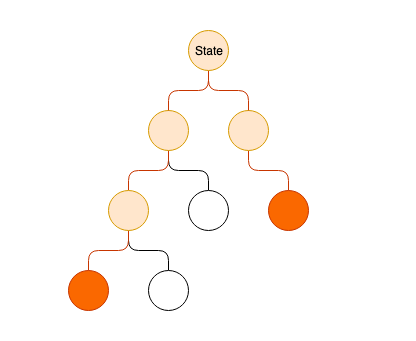
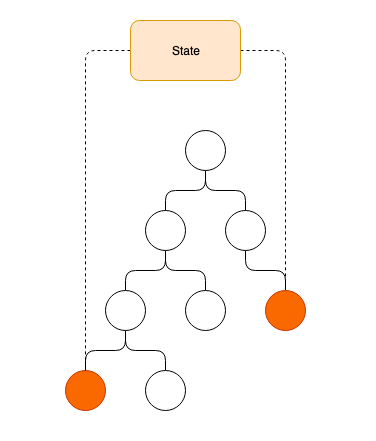
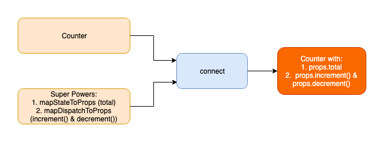

# React Redux Introduction

### Learning Objectives
- Be able to use Redux in a single component app using React-Redux
- Be able to create a Redux store and share it with React components
- Be able to access the store's state from inside a React component
- Be able to configure the Redux Dev Tools

## Introduction

When creating React applications without Redux, we have been storing application state in the parent component of all the children that need access to that state. For small applications this is often appropriate, but in a bigger application it can lead to having a lot of state in the top level container, to ensure that is can be shared between children and grand-children. This leads to passing down state and callbacks as props through several generations of components, to get them to the component where they need to be accessed.



*Application without Redux where state has to be passed down several generations of components*

This diagram shows how state has to be passed down through multiple generations of components which do not need that state, in order to get it to where it needs to be accessed.

Redux abstracts state away, keeping it in a central store, that can then be accessed directly by different parts of the application.



*Application with Redux where state is kept in the redux store and accessed directly from where it is needed*

Redux provides a single place that state is stored. This makes our application easier to reason about. It also means less passing down of state and callbacks as props through generations of component as our applications grow.

We have seen that Redux is a state management library that can be used independently of framework. In this lesson we are going to look at using Redux in a React application. In addition to the Redux library, we also will be using the React-Redux library, which gives us a collection of methods that allow us to connect our react components to the Redux store.

## React Redux Counter Application

We are going to start out by using a simple example, with a single component, while we get used to using the methods that come from the React-Redux library. The application will display a number and allow a user to increment and decrement the number by clicking either a '+' or a '-' button.

Let's start by creating a React application with Create React App and run it.

```bash
npx create-react-app react_redux_counter
cd react_redux_counter
npm start
```

We will need to install Redux and because we are using Redux in a React app we will need a second package: React-Redux. React-Redux will give us some methods that allows us to access the store from inside our components.

```bash
npm install redux react-redux
```

### Counter Component

We are going to start by creating a `Counter` component.

```bash
touch src/Counter.js
```

Previous to using Redux our Counter component would initialise it's own state in order to keep track of the current total. Now we are using Redux, the state will not be initialised inside the component. Instead Redux will be taking care of storing the state outside of the component.

We will begin by rendering a hard-coded total with the buttons, and afterwards connect the component to the Redux store.

```js
// Counter.js

import React from 'react';

const Counter = (props) => {
  return (
    <>
      <h1>Counter</h1>
      <h3>0</h3>
      <button>+</button>
      <button>-</button>
    </>
  );
}

export default Counter;
```

Let's tell index.js to render `Counter`.

```js
// index.js
import Counter from './Counter'; // NEW

ReactDOM.render(
  <Counter />, // UPDATED
  document.getElementById('root')
);
```

Ok, so we have our boilerplate code. Now we are going to think about managing the total in state, updating it with the click of the buttons, and re-rendering the UI as it changes.

### React-Redux

We are going to follow the same work flow that we followed when we were writing a vanilla JavaScript app with Redux. We will:

1. Reducer: Create the reducer that knows how to update the state.
2. Store: Create the store, passing it the reducer (At this point we will need to look at how we give our application access to the store.)
4. Actions: Each button needs to dispatch an action when it is clicked.
5. Subscribe: The new total needs to be re-rendered to the screen each time the state is changed.

### Reducer

This application will only have one reducer, but as our applications grow, we may need more. Let's provide some structure to our directory structure by creating a 'reducers' directory.

```bash
mkdir src/reducers
touch src/counter_reducer.js
```

A reducer is pure function that takes two arguments, the current state and an action.

```js
const counterReducer = (state = 0, action) => {

}

export default counterReducer;
```

We will handle the two actions that we are expecting, `'INCREMENT'` and `'DECREMENT'`, calculating the new state for each. And if neither case is true, we will return the existing state unmodified.

```js
const counterReducer = (state = 0, action) => {
  switch(action.type) {
    case 'INCREMENT':
      return state + 1
    case 'DECREMENT':
      return state - 1
    default:
      return state;
  }
}

export default counterReducer;
```

That's our reducer completed.

### Store

Next we need to make the store, giving it the reducer we have just written. We want the store to be accessible to the whole application, so we are going to create it in index.js.

We'll import the `createStore` method from Redux, and the reducer we've just written. Then we can create the store, passing `createStore` the reducer as an argument.

```js
// index.js

import Counter from './Counter';
import { createStore } from 'redux'; // NEW
import counterReducer from './reducers/counter_reducer'; // NEW

const store = createStore(counterReducer); // NEW
```

### React-Redux Provider

We have created the store with the reducer. We now need to make the store accessible to the components. We could pass the store to each component via props, but this would be repetitious. Instead we can pass the store on props to a special component from the React-Redux library, `Provider`, and all of it's children will have access to the store.

So in our case the `<Provider />` has `<Counter />` as its child and gives it the store on its props, so `<Counter />` will have access to the store.

```js
import { Provider } from 'react-redux'; // NEW

ReactDOM.render(
  <Provider store={store}> // NEW
    <Counter />
  </Provider>, // NEW
  document.getElementById('root')
);
```

We should now see by looking at the `Context.Provider` in the React dev tools, that in its props, it has a value object that has a store state of 0.

## Connecting a Component to the Redux Store

In order to connect our `Counter` component to the store we need to use React-Redux's `connect` method. The `connect` method is specifically for connecting React components to the Redux store, so that the React component is able to dispatch actions and access the state.

You can think of the `connect` method as giving a plain old React component some super powers (the ability to dispatch actions and get state from the store).


*React-Redux's `connect`*

When we are exporting our `Counter` component, rather than exporting it directly, we export it connected to the store.

```js
// Counter.js

import { connect } from 'react-redux'; // NEW

// ...

export default connect()(Counter); // NEW
```

`connect` is a function that returns a high-order component (HOC). A HOC is a component that takes another component as an argument and returns it wrapped with some extra custom props.

So in our our case, `connect` returns a higher-order component, which we then pass `Counter` component to. `Counter` is then exported from the file, with the additional super powers on it's props.

## Defining the Super Powers

Now we need to define the super powers that we want `Counter` to have. Defining the super powers involves deciding how this component is going to be able to interact with the store.

When writing a component that is going to be connected to the store, you always need to ask two questions:

1. Will my component need to access the state in order to display it?

If yes, you need to create a `mapStateToProps` function, which gives the component access to the parts of it needs to display.

2. Does my component need to update the state?

If yes, you need to create a `mapDispatchToProps` function, which gives the component access the ability to dispatch actions that will update the state.

Both `mapStateToProps` and `mapDispatchToProps` are passed to the `connect` method.

By doing this our `Counter` component will have the additional props, allowing it to read the total from the state and giving it some functions that allow it to dispatch actions to update the state.



*The connected Counter component*

### Mapping State to Props - `mapStateToProps`

We know that our `Counter` component needs access to the state, so it can display the current counter total. Therefore we need to write a function that is called `mapStateToProps` by convention.

`mapStateToProps` is a function that tells Redux which part of the state the component needs access to. `mapStateToProps` get's passed the whole state and we need to return an object containing whichever part of state is required by this component - for us it's just 'state' as our state only has one value. We'll store it on the the key `total`.

```js
const Counter = (props) => {
  // ...
}

const mapStateToProps = state => {
  return {
    total: state
  }
}
```

Whatever properties we define on the object we are returning from `mapStateToProps`, will be available on props in the `Counter` component. So we are making `props.total` available to `Counter` by writing this function.

Lastly we need to pass `mapStateToProps` to the `connect` method, so that the `Counter` component is exported with the store state mapped to its props. (It's first super power!).

```js
// ...

export default connect(mapStateToProps)(Counter); // UPDATED
```

Now we can see in the React dev tools that the Counter has a `total` prop with the value 0.
Let's render it in the component.

```js
const Counter = (props) => {
  return (
    <>
      <h1>Counter</h1>
      <h3>{props.total}</h3> // UPDATED
      <button>+</button>
      <button>-</button>
    </>
  );
}
```

Great, so we have written a reducer, created a store, made the store available to the application. We then mapped the store's state to the component's props, so we could render it.

### Actions

So we are rendering the store's state in the component. Now we need to be able to update the state on click of one of the buttons. To do this we are going to dispatch an action each time a button is clicked, which will be passed to the reducer, which knows how to calculate the new state.

### Mapping Dispatch to State - `mapDispatchToState`

Just as we had to map the props to state, we also need to map the dispatched actions to the state. By convention we do this in a function called `mapDispatchToState`, which we are going to pass to `connect` as the second argument.

`mapDispatchToState` is passed the dispatch function. We need to return an object that contains all the dispatch function that this component will need. We have two actions; increment and decrement.

```js

const mapStateToProps = state => {
  // ...
}

const mapDispatchToProps = dispatch => { // NEW
  return {
    increment: () => {},
    decrement: () => {}
  }
}
```

Each function will use the `dispatch` function to dispatch an action with a `type` property.

```js
const mapDispatchToProps = dispatch => {
  return {
    increment: () => {
      dispatch({ // NEW
        type: 'INCREMENT'
      })
    },
    decrement: () => {
      dispatch({ // NEW
        type: 'DECREMENT'
      })
    }
  }
}
```

Whatever functions we define on the object we are returning from `mapDispatchToProps`, will be available on props in the `Counter` component. So we are making `props.increment()` and `props.decrement()` available to `Counter` by writing this function.

And we pass `mapDispatchToProps` as the second argument to connect. (It's second super power!)

```js
export default connect(mapStateToProps, mapDispatchToProps)(Counter);  // UPDATED
```

Now if we look in the React dev tools that the `Counter` component has those methods as its props, so we can call them on click of the buttons.

```js
const Counter = (props) => {
  return (
    <>
      <h1>Counter</h1>
      <h3>{props.counter}</h3>
      <button onClick={props.increment}>+</button> // UPDATED
      <button onClick={props.decrement}>-</button> // UPDATED
    </>
  );
}
```

Now, when the buttons are clicked, the `increment`/`decrement` function is called, which dispatches the relevant action, which is used by the reducer to calculate the new state. When the state is updated in the store, the `mapStateToProps` picks up the change and the new `total` prop is passed to `Counter`, re-rendering the page.

> Note: `mapStateToProps` is the React-Redux replacement for subscribing to the store and calling `store.getState()`. `mapStateToProps` replaces calling `store.dispatch()`. `mapStateToProps` and `mapStateToProps` is the way we interact with the Redux store from a React application, rather than interacting with the store directly.

## Redux Dev Tools

There is a Redux Dev Tools Chrome Extension that we can install.
https://chrome.google.com/webstore/detail/redux-devtools/lmhkpmbekcpmknklioeibfkpmmfibljd?hl=en

In order to use it we also have to configure it in our app. In index.js we need to import the `compose` method from Redux.

```js
import { createStore, compose } from 'redux'; // UPDATED
```

The Chrome Dev Tools extension is available on the `window` object and we can tell `createStore` to use it. We need to specify to use the Chrome Dev Tool Extension is if it installed, otherwise just to use the regular `compose`.

```js
const composeEnhancers = window.__REDUX_DEVTOOLS_EXTENSION_COMPOSE__ || compose; // NEW

const store = createStore(counterReducer, composeEnhancers()); // UPDATED
```

Now when we look in the dev tools we should a Redux tab, and when we click on it we see some tools that show us useful information such as state changes and actions being dispatched.

## Conclusion

We have used the Redux library to create the store, and to dispatch actions. We have also used the React-Redux to make the store available to the application, using the Provider, and to connect the component to the redux store.
