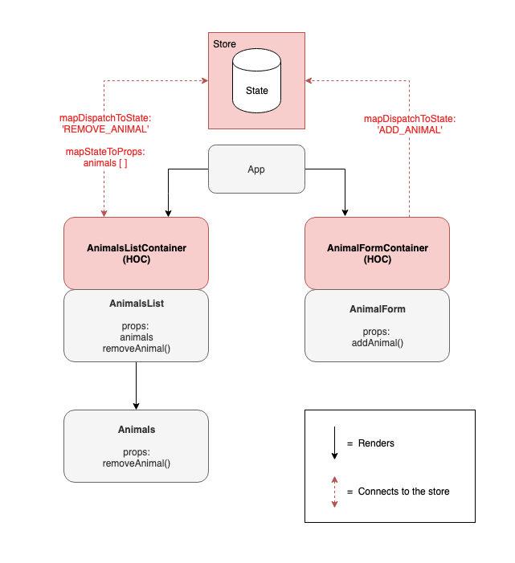

# Lab: Multiple Components Animal Shelter Solution

#### Part 1

Draw a diagram that details:
  - the component rendering hierarchy
  - the redux store
  - components that connect to the store to get state
  - components that connect to the store to dispatch actions
  - any props pass to components
  - any state that the components have



#### Part 2

Answer the following questions:

1. If we want to connect a component to the Redux Store, which method do we use?

`connect`, which comes from the `react-redux` library.

2. If a component needs to update the state, which function do we need to create to pass to `connect`?

`mapDispatchToProps`

3. If a component needs to read from the state, which funciton do we need to create to pass to `connect`?

`mapStateToProps`

4. If we have a component that needs to update the state, but not read from it, what is the first argument we pass `connect`.

We pass `null` to `connect` as the first argument. We do this in the `NewAnimalContainer`, with:

```js
export default connect(null, mapDispatchToProps)(AnimalForm);
```

The `NewAnimalContainer` only needs to add a new animal to state (update state), not read state.

5. All the components in the `containers` directory are higher-order components (HOCs). What makes them higher-order components?

They all take in a component and return that component wrapped with additional props.
